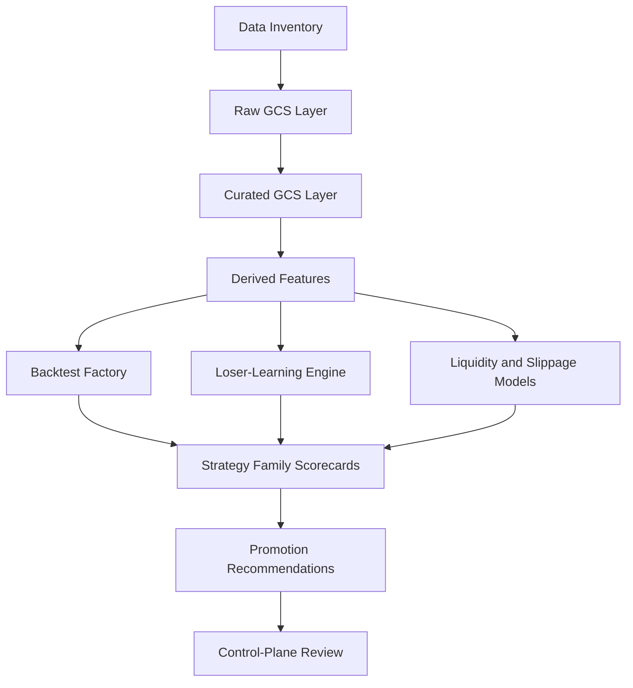

# GCP Institutional Researcher Buildout Plan

This packet defines how to build the project research plane into an institutional-grade researcher while the execution plane continues paper-account validation.

The research plane is allowed to be broad, creative, and compute-heavy. It is not allowed to bypass promotion governance, mutate live execution inputs, or weaken broker-audited evidence discipline.

## Strategic Thesis

The project already has useful assets:

- weeks of backtests and paper-session data
- strategy families and runner manifests
- Alpaca paper execution evidence
- a sanctioned GCP execution VM
- GCS buckets for durable research and control artifacts
- an emerging teaching-gate and promotion-policy layer

The next advantage should come from converting those assets into a repeatable research factory:

- normalize historical evidence
- classify loser and winner behavior
- run broad but bounded experiments
- score symbols, families, and structures
- promote only when paper execution evidence supports it

## Where We Are Now

Current state:

- execution validation is still the critical path for live readiness
- the first sanctioned VM paper session is not launched yet
- April 23 evidence is finalized but `review_required`
- automatic learning is disabled for April 23
- the Friday April 24 scorecard exists and is advisory only
- GCS has control-plane packets, April 23 evidence, and the first Friday scorecard
- runner repo contains sample backtest workflow/config assets that should be inventoried before building new tooling

Current hard boundary:

- research may run overnight and through the weekend
- research may not change live manifest, strategy selection, risk policy, execution VM topology, or exclusive-window rules

## Where We Want To Be

### By Friday Morning, April 24

- control-plane packets current in GitHub and GCS
- Friday scorecard refreshed
- existing downloader/backtest/data assets inventoried
- April 23 loser clusters classified
- data-quality status for the governed 11-name universe published
- no automatic strategy promotion

### By Friday After Close

- sanctioned VM paper session assimilated
- broker-audited evidence contract generated
- teaching gate generated
- loser-learning updated with Friday evidence
- Friday scorecard performance reviewed against actual results

### By Monday Morning

- GCS research layout established for raw, curated, and derived data
- backtest and paper-session results normalized into common tables
- loser/winner comparison tables available
- strategy-family league tables available
- liquidity and slippage scorecards available
- Monday scorecard generated
- quarantine/hold recommendations ready for review

### By Two Weeks

- repeatable research batch lane running from GCS
- experiment registry and strategy metadata schema enforced
- family-level and symbol-level promotion candidates scored
- loser-similarity filter available for pre-open review
- execution evidence gates integrated into research learning

### By Live-Pilot Readiness

- at least 20 trusted broker-audited paper sessions
- no recent residual-position incidents
- no unresolved broker/local cashflow drift in counted samples
- positive after-cost expectancy in trusted samples
- strategy-family drawdown and loss clusters understood
- live pilot proposal limited to tiny size and explicitly reviewed

## Research Plane Architecture

## Data Layers

### Raw

Purpose:

- immutable downloaded source data

Examples:

- underlying bars
- option snapshots
- contract master snapshots
- backtest raw outputs
- paper-session raw evidence

GCS prefix:

- `gs://codexalpaca-data-us/raw/`

### Curated

Purpose:

- cleaned, schema-checked, joinable research data

Examples:

- symbol/date normalized bars
- option context panels
- normalized completed-trade tables
- normalized strategy metadata
- backtest result tables

GCS prefix:

- `gs://codexalpaca-data-us/curated/`

### Derived

Purpose:

- model-ready and decision-ready outputs

Examples:

- liquidity scores
- slippage envelopes
- loser-similarity features
- regime features
- strategy-family rankings
- ticker/structure scorecards

GCS prefix:

- `gs://codexalpaca-data-us/derived/`

### Control Summaries

Purpose:

- compact operator-facing packets

Examples:

- Friday scorecard
- Monday scorecard
- data-quality verdicts
- research run manifests
- promotion recommendations

GCS prefix:

- `gs://codexalpaca-control-us/research_scorecards/`
- `gs://codexalpaca-control-us/research_manifests/`

## Research Domains

### 1. Strategy Family Research

Research allowed:

- opening-window strategies
- trend continuation
- trend reversal
- choppy/range structures
- defined-risk verticals
- butterflies and iron butterflies
- premium-defense structures
- convexity-sensitive structures
- single-leg alternatives with stricter liquidity and stop controls

Outputs:

- family expectancy by regime
- family drawdown behavior
- family stop-loss clustering
- family slippage sensitivity
- family promotion state

### 2. Ticker Research

Research allowed:

- start with governed 11-name universe
- expand research-only candidate watchlists after data-quality gates
- rank symbols by liquidity, spread, fill quality, and strategy fit

Ticker expansion rule:

- research-only expansion can be broad
- execution eligibility remains governed and separate

### 3. Loser And Winner Learning

Research allowed:

- loser taxonomy backfill
- winner/loser contrast tables
- repeated structural failure detection
- near-miss and stopped-out pattern mining
- daypart and regime failure attribution

Outputs:

- hold/kill/quarantine recommendations
- loser-similarity penalties
- strategy-family review packets

### 4. Backtest Factory

Research allowed:

- run broad backtests over existing strategy families
- search parameter surfaces
- run walk-forward slices
- run daypart/regime stratification
- compare strategy class behavior before and after slippage assumptions

Required controls:

- every backtest has an experiment id
- every result stores data version and code version
- every promoted idea must survive out-of-sample and broker-evidence gates

### 5. ML And Statistical Research

Allowed now:

- ranking models
- slippage models
- spread-quality classifiers
- regime classifiers
- loser-similarity models
- anomaly detection
- clustering of strategy families and symbols

Not allowed in execution yet:

- black-box live signal generation
- automatic model-to-manifest promotion
- sizing changes from unreviewed model output

## Experiment Registry

Every research run should emit:

- `experiment_id`
- `generated_at`
- `code_ref`
- `data_version`
- `universe`
- `strategy_family`
- `hypothesis`
- `parameters`
- `train_window`
- `test_window`
- `cost_estimate`
- `status`
- `primary_metric`
- `risk_metric`
- `promotion_recommendation`
- `artifact_paths`

Registry prefix:

- `gs://codexalpaca-control-us/research_manifests/`

## Research Quality Gates

No research output should be promoted to operator decision unless it passes:

- data completeness check
- schema check
- timestamp sanity check
- duplicate row check
- impossible OHLC check
- option spread sanity check
- slippage assumption check
- out-of-sample split check when applicable
- evidence contamination check
- cost and storage note

If any critical gate fails:

- research output state is `review_required`
- recommendations may be viewed but not used for promotion

## Promotion Boundary

Research can recommend:

- `prefer`
- `allow_cautious`
- `shadow`
- `hold`
- `quarantine_review`
- `kill_review`

Research cannot directly:

- edit live manifest
- edit risk policy
- activate blocked profiles
- widen execution universe
- modify the exclusive-window lifecycle

Control-plane governance owns promotion decisions.

## Overnight Buildout Phases

### Phase 1 - Inventory Existing Assets

Find and catalog:

- downloader scripts
- data directories
- backtest workflows
- backtest configs
- existing reports
- runtime paper-session evidence
- GCS research/control buckets

Output:

- `research_asset_inventory_2026-04-24.json`
- `research_asset_inventory_2026-04-24.md`

### Phase 2 - Establish GCS Research Manifests

Create compact manifests for:

- available local runtime evidence
- available local backtest outputs
- available GCS raw/curated/derived prefixes
- missing data by symbol/date

Output:

- GCS research manifest under `gs://codexalpaca-control-us/research_manifests/`

### Phase 3 - Normalize Paper Session Evidence

Build derived tables from April 22 and April 23:

- completed trades
- strategy performance
- broker/local economics comparison
- evidence contract verdicts
- teaching gate verdicts
- risk incidents

Output:

- paper-session learning table
- evidence-quality table

### Phase 4 - Loser-Learning Backfill

Classify April 23 losses:

- symbol
- family
- strategy class
- entry bucket
- exit reason
- structure class
- spread quality
- economics drift status
- recommended governance action

Output:

- loser-cluster table
- loser-similarity penalty map

### Phase 5 - Data Quality And Downloader Fill

Use existing downloader paths only.

Actions:

- verify historical bar coverage for governed symbols
- verify option snapshot availability
- fill missing data only when downloader path is clearly non-broker-facing

Output:

- data-quality verdict
- missing-data worklist

### Phase 6 - Backtest And Family League Tables

Run broad but governed research:

- family by regime
- ticker by family
- daypart by family
- defined-risk vs single-leg behavior
- slippage-adjusted expectancy

Output:

- strategy-family league table
- Monday watchlist seed

### Phase 7 - ML-Lite Ranking

Build non-execution advisory models:

- liquidity quality rank
- slippage risk rank
- loser-similarity rank
- regime cleanliness rank
- symbol/structure fit rank

Output:

- Friday refresh scorecard
- Monday pre-open scorecard seed

## Weekend Expansion

If overnight artifacts are clean:

- expand research-only symbol candidate list
- add richer option snapshot history
- add walk-forward testing
- add parameter-surface scans
- run multiple strategy families through the same scorecard framework

Still defer:

- live promotion
- risk-policy mutation
- automatic model-driven trade selection
- full tick/L2/news ingestion

## Operating Principle

Research can be ambitious. Execution must remain conservative.

The institution-grade researcher should discover edges aggressively, but every edge must pass data-quality, out-of-sample, broker-reality, and promotion-governance gates before it can affect live or paper execution.

